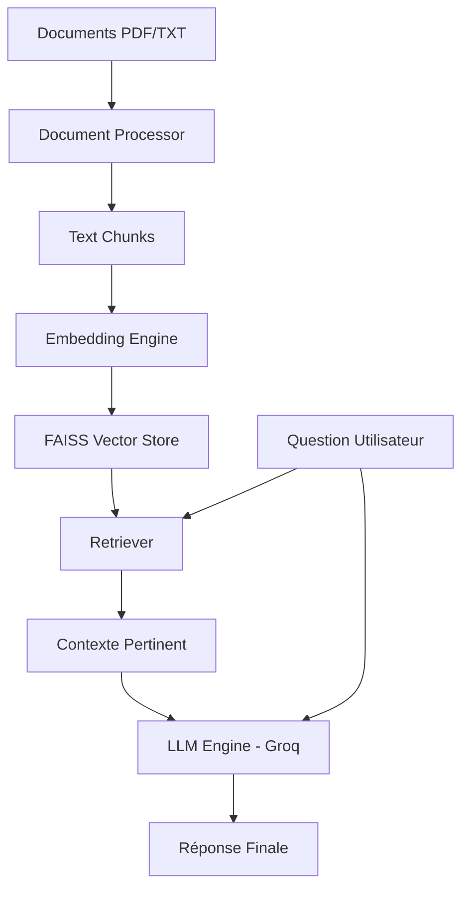

# Rapport de Projet : CareerPath AI

## 1. Introduction
Ce projet a été réalisé dans le cadre du module d’IA Générative. Il consiste en la création d'un système **RAG (Retrieval-Augmented Generation)** nommé **CareerPath AI**, conçu pour assister les étudiants dans leurs recherches de stages et le développement de leurs compétences techniques.

## 2. Objectif
L'objectif principal est de fournir des réponses fiables et contextualisées basées sur un corpus de documents réels (guides de préparation aux entretiens, roadmaps technologiques, fiches de postes).

## 3. Architecture du Système
Le système suit une architecture modulaire composée de quatre composants principaux :
1. **Ingestion des données** : Chargement et découpage (chunking) des documents.
2. **Indexation Vectorielle** : Transformation du texte en embeddings et stockage dans FAISS.
3. **Moteur de Recherche (Retriever)** : Récupération des segments les plus pertinents par rapport à la question.
4. **Génération LLM** : Utilisation du modèle Llama-3 via l'API Groq pour générer une réponse basée sur le contexte.

## 4. Pipeline RAG
### 4.1 Ingestion & Chunking
- **Taille des chunks** : 500 caractères.
- **Overlap** : 50 caractères pour maintenir la continuité sémantique.
- **Loader** : LangChain `DirectoryLoader` supportant TXT et PDF.

### 4.2 Embeddings & Base Vectorielle
- **Modèle d'embedding** : `all-MiniLM-L6-v2` (HuggingFace), léger et performant en local.
- **Base Vectorielle** : **FAISS** (Facebook AI Similarity Search) pour une recherche rapide par similarité cosinus.

### 4.3 Génération (Prompt Engineering)
Le prompt a été conçu pour limiter les hallucinations en forçant le modèle à répondre uniquement à partir du contexte fourni.

## 5. Implémentation Technique
- **Langage** : Python 3.10+
- **Frameworks** : LangChain, Streamlit
- **LLM** : Groq (Llama-3.3-70b-versatile)
- **Base de données** : FAISS

## 6. Résultats
Le système est capable de répondre avec précision à des questions telles que :
- "Quelles sont les compétences pour un stage Spring Boot ?"
- "Comment préparer mon CV pour le secteur tech ?"
- "Différence entre Angular et React ?"

## 7. Conclusion
CareerPath AI démontre la puissance du RAG pour transformer des documents statiques en un assistant interactif et intelligent. Le système est modulaire et peut être facilement étendu avec de nouveaux documents.
